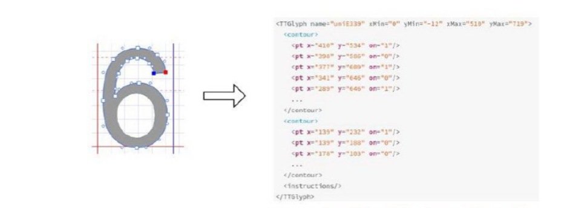

# 字体反爬策略

 CSS3时代，开发者使用@font-face为网页指定字体，就不必依赖计算机字体。于是我们爬虫就有了下面这种情况：


这里评分、评论人数、票房的网页源码为乱码。


## 1、字体加载原理

我们访问页面的时候，源代码会有以下类似的代码：


这里的src: url()括号里面就是字体下载的地址，有兼容多种浏览器的版本的url，我们通常用format('woff')的那个即可。把这个url拷贝到浏览器的地址栏中即可下载。

我们也可以通过浏览器的调试工具查看加载过程，会在**Network**--**Font**选项卡中看到：


下载好字体后，利用fontLab打开即可看到**“字形码”**和**”对应的真正的数值“**。这两个概念稍后会细说。


## 2、解决方法

我们爬虫抓取到的文本内容直接打印肯定出现乱码，因为我们电脑上没有别人自定义的新字体。

第一步需要利用fontLab人工构建**字形码：真正的数值**的字典映射。

第二步通过这些乱码推导出字形编码，['uni' + '%x'.upper() % ord(i) for i in char_raw]，即将每个字符转为16进制显示可得到字形码。之后利用上方的字典即可得到真正的数值。


之后再调用下图获取真正数字的函数即可


多数情况下网站就一套字体，毕竟制作字体的成本也较高，可以通过上方思路解决。当然，如果网站有多套字体就比较麻烦了，你可以说我每套字体都下载下来人工映射没问题。

关于多种字体的破解问题，以前是字形对象没有变，字形编码会变；现在是两者都变。所以利用字形对象相等的原理已经不行了。所以解决方法无非机器学习或者网上付费自动识别的api了。

下方简单介绍了字体、字形的概念，以及破解的难处。


## 3、字体背后的细节问题

**（1）**WOFF（Web Open Font Format，Web 开放字体格式）是一种网页所采用的字体格式标准。字体中的每个字形由网

格上的一系列点描述，点是字体中的最小单位。


字体文件中不仅包含字形数据和点信息，还包括字符到字形映射、字体标题、命名和水平指标等，这些信

息存在对应的表中。

这里通过Python的三方库，**pip install fonttools**，将字体存储为xml文件，打开后即可看到字体的详细信息。

```
from fontTools.ttLib import TTFont
font = TTFont('9fc50aa7.woff')
font.saveXML('movie.xml')
```


图中x和y即为点的坐标，这么多点构成了我们看到的字形。




**（2）破解难处**

以前我们可以比较字体对象是否相等来判断是否是同一个字，现在较难。

比如这个“6”，

**第一**： 每套字体同样是“6”，但点的个数不同；

**第二： **还有可能点的坐标会发生偏移。

下方这个图展示是，不同字体对应相同字形的点的个数，蓝色线就是相同字形的点的差异：


下方这个图是，具体字形在fontLab中显示的点的对比（右边的3比左边的多了两个点）：


同一个字形，点的坐标发生偏移，见下图：


