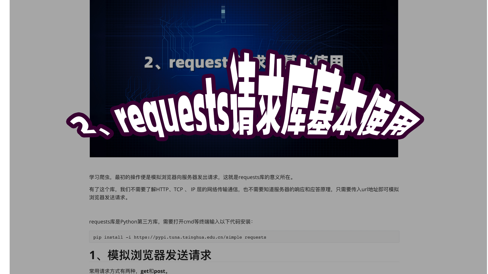

# 2、requests请求库基本使用




学习爬虫，最初的操作便是模拟浏览器向服务器发出请求，这就是requests库的意义所在。

有了这个库，我们不需要了解HTTP、TCP 、 IP 层的网络传输通信，也不需要知道服务器的响应和应答原理，只需要传入url地址即可模拟浏览器发送请求。


requests库是Python第三方库，需要打开cmd等终端输入以下代码安装：

```
pip install -i https://pypi.tuna.tsinghua.edu.cn/simple requests
```

# 1、模拟浏览器发送请求

常用请求方式有两种，**get**和**post。**

**get请求基本模式：**

```
# get请求常用参数
requests.get(url, headers, proxies, cookies, timeout, verify)
```

**post请求基本模式**

```
# post请求常用参数
requests.post(url, headers, proxies, timeout, verify, data)
```

# 2、Response对象和它的基本属性

```
# 模拟浏览器发送get请求
response = requests.get("https://www.baidu.com")
# 打印response对象类型
print(type(response))

# 打印响应体状态码
print(response.status_code)

# 打印url
print(response.url)

# 打印cookie的内容
print(response.cookies)

# 响应体的文本内容
print(response.text)    #根据html的头部来猜编码，可能不准确
print(response.content.decode("utf-8"))   # 自己根据charset手动解码
print(response.content.decode("gbk"))

# 如果返回的是json格式，将会把json转为字典
print(response.json())
```

# 3、添加请求头（headers）

```
headers = {
    "User-Agent": "你自己的浏览器请求头",
    "referer": "https://www.zhihu.com/"
}
```

# 4、添加代理（proxies）

```
proxies = {
    "http": "http://10.10.1.11:3298",
    "https": "http://10.10.1.11:3452"
}
```

# 5、添加cookie

```
cookies = """_zap=68f867be-eerr-adb2-02759bb15a46; d_c0="ALBSeVe2uRGPTjF2LXmnPte5Is74=|15973rw5xxxxxx...""""
cookies = {i.split("=")[0]:i.split("=")[1] for i in cookies.split("; ")}
```

# 6、添加超时设置（timeout）

在本机网络状况不好或者服务器网络响应太慢甚至无响应时，我们可能会等待特别久的时间才可 能收到响应，甚至到最后收不到响应而报错。为了防止服务器不能及时响应，应该设置一个超时时间，即超过了这个时间还没有得到响应，那就报错。这需要用到 timeout 参数。这个时间的计算是发送请求到服务器返回响应的时间 。单位是秒。

例：

```
r = requests.get("https://www.baidu.com", timeout=1)
```

# 7、设置SSL证书验证（verify参数）

默认是True，即验证当前网页是否有SSL证书，没有会报错。

可以设置如下设置关闭验证：

```
response = requests.get("https://www.12306.cn", verify=False)
```


早期12306网站没有SSL证书访问时的状态