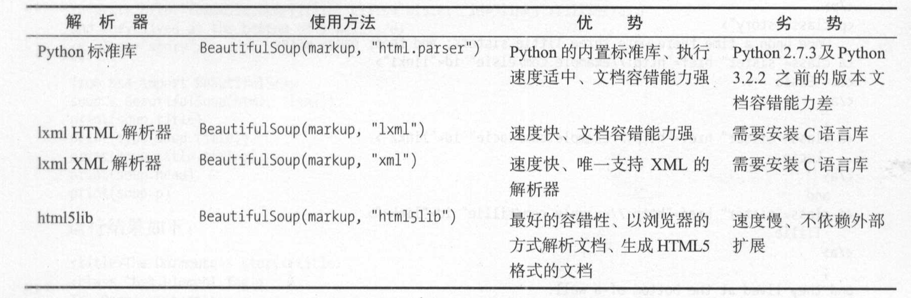

# 4、爬虫解析库BS之1080P美女壁纸批量下载

## 一、BeautifulSoup解析库

#### **1、概述**

Beautiful Soup 就是 Python 的一个 HTML 或 XML 的解析库， 可以用它来方便地从网页中提取数据。

**pip install bs4**


#### **2、解析器**

BeautifulSoup 在解析时实际上依赖解析器， 它除了支持 Python 标准库中的 HTML 解析器外， 还支持一些第三方解析器（比如 lxml ）。



对于我们来说，我们最常使用的解析器是lxml HTML解析器，其次是html5lib。


#### **3、CSS选择器**

我们在使用BeautifulSoup解析库时，经常会结合CSS选择器来提取数据。

我们先来了解什么是CSS选择器，其实也很简单。

**注意：**

**以下讲解CSS选择器只选择标签**，至于获取属性值和文本内容我们后面再讲。

```
（1）根据标签名查找
比如写一个 p  就会选择所有p标签，不过我们一般不用，因为我们都是精确到标签再提取数据的

（2）根据类名class查找
.line，即一个点加line       这个表达式选的是class="line"的所有标签，“.”代表class

（3）根据id查找
#box，即一个#和box          表示选取id="box"的所有标签，“#”代表id

（4）根据属性的名字查找
class属性和id属性较为特殊，故单独拿出来定义一个“.”和“#”来表示他们。
如果根据这个标签的其他属性查找怎么办呢？
input[name="username"]      这个表达式查找name="username"的标签，此处注意和xpath语法的区别

（5）标签+类名或id的形式
div#line       查找id="line"的div标签，这种查找就更加精确了
div.line       查找class="line"的div标签

（6）查找直接子元素
这种和（7）要讲的查找方式用于拼接查找.
#box>p         查找id="box"的标签下的直接子标签p

（7）查找子孙标签
#box p         #box和p之间是一个空格，这个表达式查找id="box"的标签下的子或孙标签p
```


#### **4、BeautifulSoup结合CSS选择器在Python中使用**

**`# 导入BeautifulSoup解析库**
**from bs4 import BeautifulSoup**

**soup = BeautifulSoup(html, "lxml")**

**list1 = soup.select(".list")`**


**(1) 查找函数select()**

括号内传入CSS选择器即可，返回值是列表。见下方举例：


示例所用html代码**：**

```
<div class =”panel”>
        <div class="panel-heading">
            <h4>Hello</h4>
        </div>

        <div class="panel-body">
            <ul class="list" id="list-1">
                <li class="element">Foo</li>
                <li class="element">Bar</li>
                <li class="element" id="li3">
                    <a href="https://www.baidu.com">百度官网</a>
                </li>
            </ul>

            <ul class="list list-small" id="list-2">
                <li class="element">Foo</li>
                <li class="element">Bar</li>
            </ul>
        </div>

    </div>
```

```
# 导入BeautifulSoup解析库
from bs4 import BeautifulSoup

soup = BeautifulSoup(html, "lxml")
# 获取class="panel-heading"的标签
heading = soup.select('.panel-heading')

# 获取class="element"的li标签
lis = soup.select('li.element')

#选取class="panel-body"标签下的class="element"的li标签
lis2 = soup.select(".panel-body li.element")

# 获取class="list list-small"的标签
# 注意针对这种可以写.list(或.list-small，即任选一个单词)，代表只要包含这个单词的标签即可被选中；也可以.list.list-small同时选择两个单词，这就表示要同时包含两个单词才能被选中
list1 = soup.select(".list")
list2 = soup.select(".list-small")
list3 = soup.select(".list.list-small")
```


**（2）获取属性值**

**标签名["属性名"]**      即可获取属性值。

例如：假如我们通过上面的方法获得了标签a，然后加上["href"]就可以得到属性值

```
aElement = soup.select("li#li3>a")[0]
href = aElement["href"]
```

**(3) 获取文本内容**

有四种方式：

(a) **string**: 获得某个标签下的文本内容，强调一个标签，不含嵌套。返回一个字符串

(b) **strings**: 获得某个标签下的所有文本内容，可以嵌套。返回一个生成器，可用list(生成器)转换为列表

(c) **stripped_strings**: 跟(b)差不多，只不过它会去掉每个字符串头部和尾部的空格和换行符

(d) **get_text()**: 获取所有字符串，含嵌套。不过会把所有字符串拼接为一个，然后返回

**注意2：**

**前3个都是属性，不加括号；最后一个是函数，加括号。**


## 二、批量下载彼岸桌面1080P美女壁纸


#### **1、技术要点**

（1）requests库请求时注意网站编码为gbk

（2）可用css选择器直接选取图片缩略图对应的链接，即css选择器".list a"下的a标签href属性

（3）对该链接发起请求，返回的html代码中含有该图片的img标签，内部的src即为图片地址

（4）requests.get请求图片地址，这次用response.content的到二进制文件。利用Python自带的open函数以**"wb"**的模式写入即可。

（5）爬取多页，第一页的url特殊，单独拿出来。其他页用for循环构造url。

#### 2、代码展示

```
# 抓取单页

import requests
from bs4 import BeautifulSoup
import os

headers = {
    'user-agent': 'Mozilla/5.0 (Windows NT 6.2; WOW64) AppleWebKit/537.36 (KHTML, like Gecko) Chrome/27.0.1453.94 Safari/537.36',
}


# 请求url，得到html代码
def get_url(url):
    response =  requests.get(url, headers=headers)
    return response.content.decode("gbk")

# 下载图片
def download(url):
    print("正在下载链接地址为 %s 的图片" %url)
    # 二进制文件
    content = requests.get(url, headers=headers).content
    # url的格式 http://img.netbian.com/file/2021/0122/2861bb5516bd41b0dfe79f6a9538892d.jpg
    # 取最后一个"/"之后的字符串作为文件名
    filename = url.split("/")[-1]
    # 拼写完整的图片路径，其中这里的"."表示当前这个文件所在的目录
    file_path = "./image/" + filename
    # 将二进制数据写入文件
    with open(file_path, 'wb') as f:
        f.write(content)


if __name__ == '__main__':
    # 判断当前目录下是否有image文件夹，没有就创建
    if not os.path.exists("image"):
        os.mkdir("image")


    url = 'http://www.netbian.com/meinv/'
    html = get_url(url)
    # 利用BeautifulSoup构建解析器
    soup = BeautifulSoup(html, "lxml")

    # 选取所有的图片所在的块区域
    aElements = soup.select('.list a')
    hrefs = [i["href"] for i in aElements]

    for href in hrefs:
        if href.startswith("/desk"):
            # url2是缩略图对应的链接
            url2 = "http://www.netbian.com" + href

            # 请求缩略图链接得到页面内容
            html2 = get_url(url2)
            soup2 = BeautifulSoup(html2, "lxml")
            src = soup2.select('.pic img')[0]["src"]
            download(src)
```


```
# 抓取多页


import requests
from bs4 import BeautifulSoup
import os

headers = {
    'user-agent': 'Mozilla/5.0 (Windows NT 6.2; WOW64) AppleWebKit/537.36 (KHTML, like Gecko) Chrome/27.0.1453.94 Safari/537.36',
}


# 请求url，得到html代码
def get_url(url):
    response =  requests.get(url, headers=headers)
    return response.content.decode("gbk")

# 下载图片
def download(url):
    print("正在下载链接地址为 %s 的图片" %url)
    # 二进制文件
    content = requests.get(url, headers=headers).content
    # url的格式 http://img.netbian.com/file/2021/0122/2861bb5516bd41b0dfe79f6a9538892d.jpg
    # 取最后一个"/"之后的字符串作为文件名
    filename = url.split("/")[-1]

    # 拼写完整的图片路径，其中这里的"."表示当前这个文件所在的目录
    file_path = "./image/" + filename
    # 将二进制数据写入文件
    with open(file_path, 'wb') as f:
        f.write(content)


if __name__ == '__main__':
    # 判断当前目录下是否有image文件夹，没有就创建
    if not os.path.exists("image"):
        os.mkdir("image")


    for page in range(1, 178):
        if page == 1:
            url = 'http://www.netbian.com/meinv/'
        else:
            url = 'http://www.netbian.com/meinv/index_%d.htm' % page
        print("正在抓取第%d页, 其url为 %s" % (page, url))

        html = get_url(url)
        # 利用BeautifulSoup构建解析器
        soup = BeautifulSoup(html, "lxml")

        # 选取所有的图片所在的块区域
        aElements = soup.select('.list a')
        hrefs = [i["href"] for i in aElements]

        for href in hrefs:
            if href.startswith("/desk"):
                # url2是缩略图对应的链接
                url2 = "http://www.netbian.com" + href

                # 请求缩略图链接得到页面内容
                html2 = get_url(url2)
                soup2 = BeautifulSoup(html2, "lxml")
                src = soup2.select('.pic img')[0]["src"]
                download(src)
```