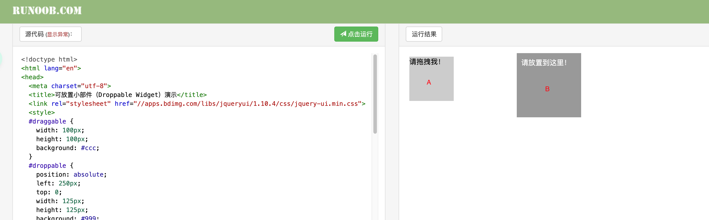
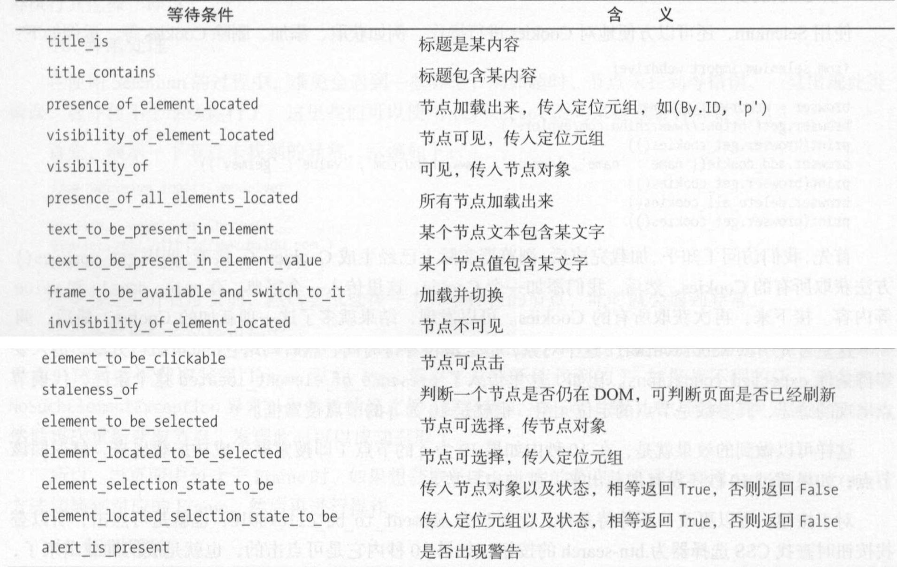

# Selenium的使用

## 0、安装

#### (1) Selenium 的安装

```
pip install selenium
```

#### (2) webdriver的下载

Selenium是一个自动化测试工具，需要配合浏览器来使用，webdriver是Selenium用来驱动浏览器的。

需要根据你的浏览器的版本下载对应的webdriver驱动。比如这里使用ChromeDriver驱动，可自行百度下载。

下载完成后，它是一个可执行文件。我们可以把它加入环境变量，之后我们再构造webdriver.Chrome()时，括号里面就不用传入驱动器的路径了。


## 1、基本使用

```python
from selenium import webdriver
from selenium.webdriver.common.keys import Keys
from selenium.webdriver.support.wait import WebDriverWait
from selenium.webdriver.support import expected_conditions as EC
from selenium.webdriver.common.by import By

# 构建Chrome浏览器的驱动对象
browser = webdriver.Chrome()
try:
    # 模拟浏览器发送请求
    browser.get("https://www.baidu.com/")
    # 根据返回的网页源代码查找id="kw"的搜索框
    input = browser.find_element_by_id('kw')
    # 在搜索框里面输入Python
    input.send_keys("Python")
    # 模拟按下enter键查询
    input.send_keys(Keys.ENTER)
    # 定义显式等待时间为10s
    wait = WebDriverWait(browser, 10)
    wait.until(EC.presence_of_element_located((By.ID, "content_left")))
    # 获取当前地址栏的url
    print(browser.current_url)
    # 获取cookie
    print(browser.get_cookies())
    # 获取网页源代码
    print(browser.page_source)
finally:
    browser.close()
```


## 2、声明浏览器对象

```
from selenium import webdriver

browser = webdriver.Chrome() 
browser = webdriver.Firefox() 
browser = webdri ver.Edge() 
browser = webdriver.PhantomJS() 
browser= webdriver.Safari()
```


## 3、访问页面

```
from selenium import webdriver
browser.get("https://www.baidu.com/")
# 获取网页源代码
print(browser.page_source)
browser.close()
```


## 4、查找节点

####   (1)  查找单节点

```
find_element_by_id
find_element_by_class_name
find_elemnet_by_xpath
find_element_by_css_selector
find_element_by_name
find_element_by_tag_name
find_element_by_link_text
find_element_by_partial_link_text
```


#### (2)  查找多个节点

```
find_elements...
```


## 5、节点交互

**常用的有：**

**（1）input.send_keys("Python")     搜索框里面输入内容，如Python**

  **(2).  input.clear()     清除搜索框里面的内容**

 **(3).  button.click()    模拟鼠标点击，button为找到的可点击的标签**

```
from selenium import webdriver
import time

browser = webdriver.Chrome()
try:
    browser.get("https://www.baidu.com/")
    # 找到input搜索框
    input = browser.find_element_by_id('kw')
    # 输入Python
    input.send_keys("Python")
		time.sleep(1)
		# 清除搜索框内容
		input.clear()
		input.send_keys("Java")
		# 找到搜索按钮
		button = browser.find_element_by_id('su')
		# 提交搜索
		button.click()
finally:
    browser.close()
```


## 6、动作链

如将下方的A放到B处：




```
from selenium import webdriver
from selenium.webdriver import ActionChains

browser = webdriver.Chrome()
browser.get("https://www.runoob.com/try/try.php?filename=jqueryui-api-droppable")
browser.switch_to.frame("iframeResult")
source = browser.find_element_by_id("draggable")
target = browser.find_element_by_id("droppable")
actions = ActionChains(browser)
actions.drag_and_drop(source, target).perform()
```


## 7、执行JavaScript

对于某些操作，Selenium没有提供操作。比如下拉进度条

**browser.execute_script（js代码）**

```
from selenium import webdriver
import time

browser = webdriver.Chrome()
browser.get("https://www.gushiwen.org/")
time.sleep(2)
# 此处将进度条滚动到最底部
browser.execute_script('window.scrollTo(0, document.body.scrollHeight)')
browser.execute_script('alert("To Bottom")')
```


## 8、获取节点信息

```
# 获取a标签的href属性
a.get_attribute("href")

# 获取节点下的所有文本信息,返回一个字符串
div.text
```


## 9、切换Frame

我们知道网页中有一种节点叫作 iframe ，也就是子 Frame ，相当于页面的子页面，它的结构和外部网页的结构完全一致。 Selenium 打开页面后，它默认是在父级 Frame 里面操作，而此时如果页面中还有子 Frame ，它是不能获取到子Frame 里面的节点的，这时就需要使用 switch_to .frame()方法来切换 Frame。

```
# 此处根据id名切换
browser.switch_to.frame("iframeResult")
```


## 10、延时等待

在 Selenium 中，get()方法会在网页框架加载结束后结束执行， 此时如果获取 page_source ，可能并不是浏览器完全加载完成的页面， 如果某些页面有额外的 Ajax 请求， 我们在网页惊代码中也不一 定能成功获取到 。 所以， 这里需要延时等待一定时间， 确保节点已经加载出来 。

这里等待的方式有两种： 一种是隐式等待， 一种是显式等待。

#### (1) 隐式等待

即固定时间等待。如果Selenium没有在DOM中找到节点，将继续等待指定的时间，在指定的时间末尾再次检查是否有该节点，没有就抛出异常。单位是s

**browser.implicitly_wait(10)**

```
from selenium import webdriver

browser = webdriver.Chrome()
browser.get("https://www.gushiwen.org/")
browser.implicitly_wait(10)
divs = browser.find_elements_by_css_selector('.left .cont')
```


#### (2) 显式等待

显式等待更加灵活，它可以指定最大等待时间，如果在这个时间之内返回就会继续往下运行代码。单位是s

首先利用**wait = WebDriverWait(browser, 10)**构建等待对象，

之后**wait.until(EC.presence_of_element_located((By.CLASS_NAME, "left")))**，EC是等待条件对象，presence_of_element_located是需要的等待条件，等待条件还有很多，具体见下方：

```
from selenium import webdriver
from selenium.webdriver.common.by import By
from selenium.webdriver.support.ui import WebDriverWait
from selenium.webdriver.support import expected_conditions as EC

browser = webdriver.Chrome()

browser.get("https://www.gushiwen.org/")
# 构建等待
wait = WebDriverWait(browser, 10)
# 构建等待条件
div = wait.until(EC.presence_of_element_located((By.CLASS_NAME, "left")))
# 构建某个按钮是否能被点击的条件
button = wait.until(EC.element_to_be_clickable((By.CLASS_NAME, "left")))
print(div.text)
```

其他等待条件：




## 11、前进和后退

平常使用浏览器时都有前进和后退功能， Selenium 也可以完成这个操作，使用back()后退，forward()前进。示例如下：

```
import time
from selenium import webdriver

browser = webdriver.Chrome()
browser.get("https://www.baidu.com/")
time.sleep(2)
browser.get("https://www.bilibili.com/")
time.sleep(2)
browser.back()
time.sleep(2)
browser.forward()
time.sleep(2)
browser.close()
```


## 12、Cookies

```
import time
from selenium import webdriver

browser = webdriver.Chrome()
browser.get("https://www.baidu.com/")
# 获取cookies
print(browser.get_cookies())
# 添加cookie
browser.add_cookie({"name": '小霸王'})
print(browser.get_cookies())
# 删除所有cookies
browser.delete_all_cookies()
print(browser.get_cookies())
time.sleep(2)
browser.close()
```


## 13、选项卡管理

首先执行js代码，**browser.execute_script('window.open()').** 打开另一个选项卡

切换到另一个选项卡 **browser.switch_to.window(browser.window_handles[1])**

关闭选项卡**browser.execute_script('window.close()')**

再切换回来  **browser.switch_to.window(browser.window_handles[0])**


```
import time
from selenium import webdriver

browser = webdriver.Chrome()
browser.get("https://www.baidu.com/")
time.sleep(2)
browser.execute_script('window.open()')
print(browser.window_handles)
browser.switch_to.window(browser.window_handles[1])
browser.get("https://www.bilibili.com/")
time.sleep(2)
browser.execute_script('window.close()')
browser.switch_to.window(browser.window_handles[0])
print(browser.page_source)

browser.close()
```


## 14、无头模式

即Selenium不再打开Chrome浏览器，通过**option = webdriver.ChromeOptions()**和**option.add_argument('--headless')**添加即可。

```
from selenium import webdriver

option = webdriver.ChromeOptions()
option.add_argument('--headless')
browser = webdriver.Chrome(options=option)
browser.get("https://www.baidu.com/")
print(browser.page_source)

browser.close()
```

